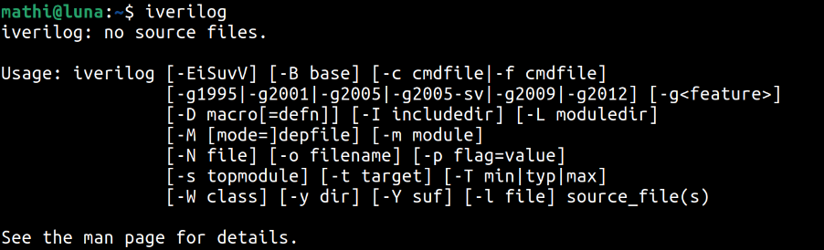

## 🚀 Week 0: Introduction and Environment Setup 🛠️

### Day 0 - Tools Installation 💻
<br>
The first day focused on getting acquainted with the course structure and setting up the necessary open-source tools for VLSI design and simulation on a Linux environment. This foundational setup is crucial for all the upcoming labs and projects. 🛰️

The primary tools installed were:
* **Icarus Verilog (`iverilog`)** 📝: A Verilog compiler used for simulating digital circuits.
* **GTKWave** 📈: A powerful waveform viewer for visualizing and analyzing the output of simulations.
* **Yosys** 🏗️: An open-source framework for Verilog RTL synthesis, which translates the hardware description into a gate-level netlist.

After the installation process, I verified that each tool was correctly set up and accessible from the terminal. 

---


**1. Icarus Verilog (`iverilog`)**
**Installation:**
```bash
sudo apt update
sudo apt install iverilog
```
**Toolcheck:**

**2. GTKWave**
**Installation:**
```bash
sudo apt update
sudo apt install gtkwave
```
**Toolcheck:**


**3. Yosys Open Synthesis Suite**
**Installation:**
```bash
sudo apt update
sudo apt install yosys
```
**Toolcheck:**


