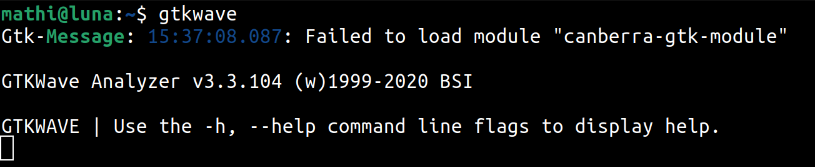
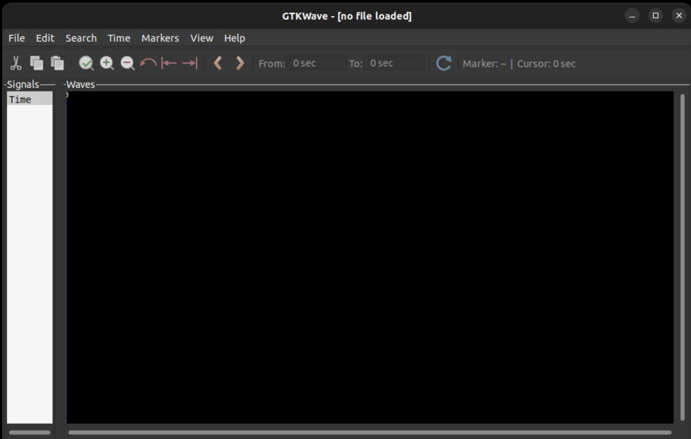
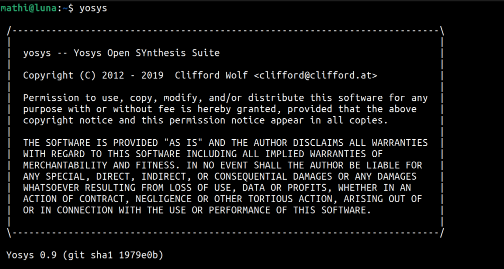

## Week 0: Introduction and Environment Setup

### Day 0 - Tools Installation
  
 
  The first day focused on getting acquainted with the course structure and setting up the necessary open-source tools for VLSI design and simulation on a Linux environment. This foundational setup is crucial for all the upcoming labs and projects.

  The primary tools installed were:
  * **Icarus Verilog (`iverilog`):** A Verilog compiler used for simulating digital circuits.
  * **GTKWave:** A powerful waveform viewer for visualizing and analyzing the output of simulations.
  * **Yosys:** An open-source framework for Verilog RTL synthesis, which translates the hardware description into a gate-level netlist.

  After the installation process, I verified that each tool was correctly set up and accessible from the terminal.

  #### Tool Installation Verification

  The following screenshots confirm the successful installation and basic invocation of the essential tools.

  **1. Icarus Verilog (`iverilog`)**

  Running the `iverilog` command in the terminal displays its usage options, confirming that the compiler is ready to use.

  

  **2. GTKWave**

  Launching `gtkwave` from the terminal successfully opens the GUI, which is now ready to load and display `.vcd` waveform files for analysis.

  
  

  **3. Yosys Open Synthesis Suite**

  Executing the `yosys` command starts the synthesis suite, confirming that the tool is installed and operational for future synthesis tasks.

  

  With the environment now set up, I am ready to proceed with the upcoming labs.
