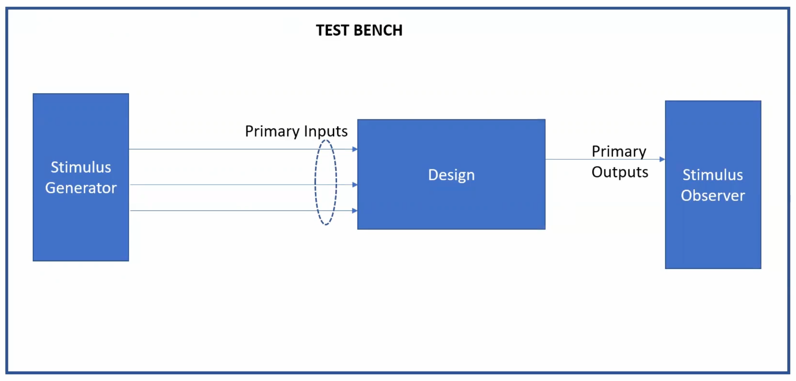
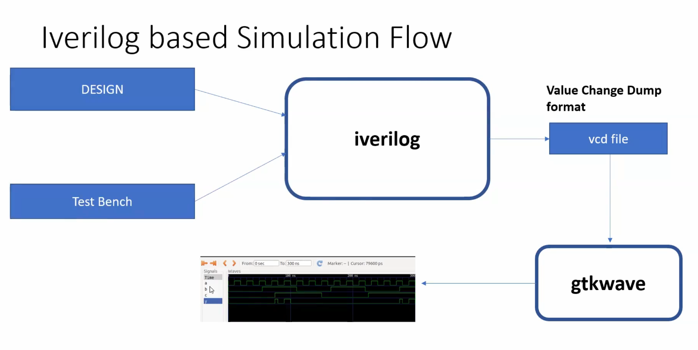
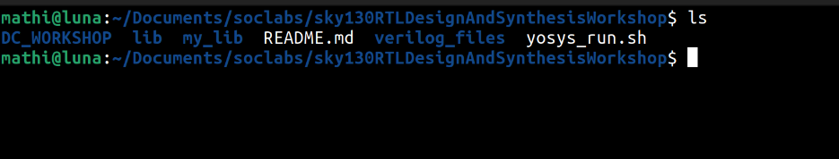
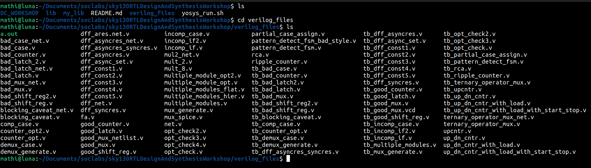
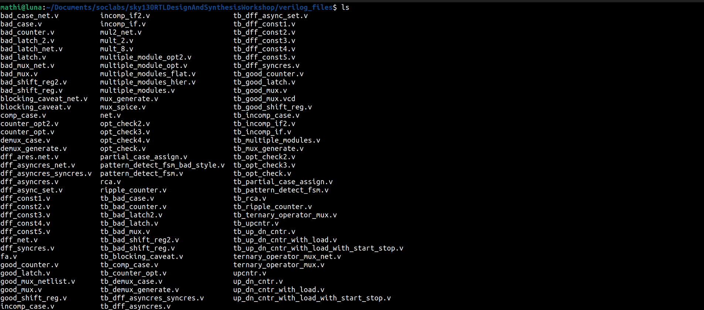
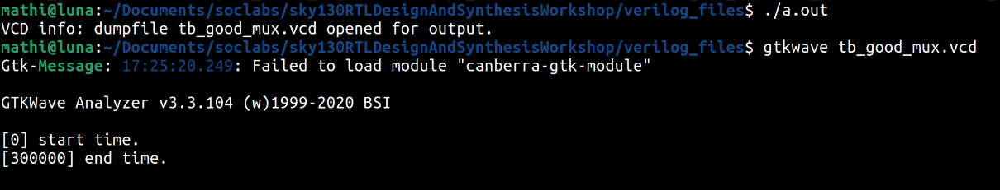
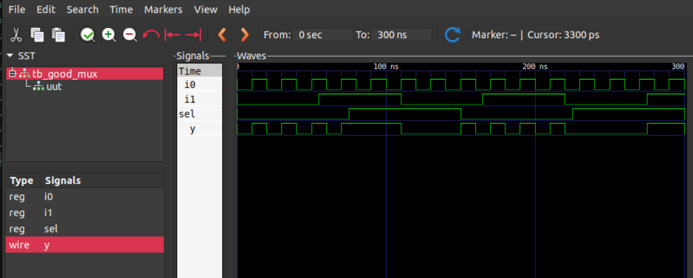

# Day1: Introduction to iverilog, design and testbench

- Simulator: tool used to checking a design (in our case: RTL)

In this program we will be using iverilog to simulate our rtl designs

- Design: verilog codes that have the intended functionalities

- Testbench: setup to apply stimulus(input) to the design to check its functionality

---


**Block diagram of the Simulating set-up**


**iverilog based Simulation flow**


1. The design and the testbench is given to the iverilog softaware which gives output as `.vcd` format.
2. This `.vcd` file is simulated using **GTKWave**  

---

# LABS:  
## L1 Lab1 introduction to lab:

1. Create an directory:
```bash
cd Documents
mkdir soclabs
```
2. Now clone the github repo in the created folder
```bash
git clone https://github.com/kunalg123/sky130RTLDesignAndSynthesisWorkshop.git
```
3. List all the folders/files in the cloned folder;
```bash
cd soclabs/sky130RTLDesignAndSynthesisWorkshop
ls
```


4. The `verilog_files` folder will have all the rtl and testbench codes used in this workshop.



---

## L2 Lab2 Introduction to iverilog and gtkwave
  
`AIM:` To simulate a design using the testbench

1. Open the `verilog_files` folder



2. Use `iverilog` to simulate the design with the testbench 

```bash
cd verilog_files
iverilog good_mux.v tb_good_mux.v
```
- This will create a a.out file.  


3. Run the `a.out` file to generate `.vcd` file.

```bash
./a.out 
```
4. Run the generated `.vcd` file using `GTKWave` 
```bash
gtkwave tb_good_mux.vcd
```


5. Now the GTKWave will be opened. Add the inputs and output signals to the signals column and click `zoom fit` to view the waveform.



6. To view the design and testbench code, use gvim.

If not installed:
```bash 
sudo apt install vim-gtk3
```

```bash 
gvim good_mux.v
gvim tb_good_mux.v
```

