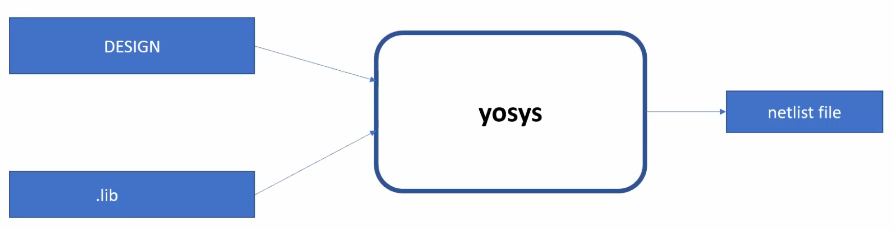
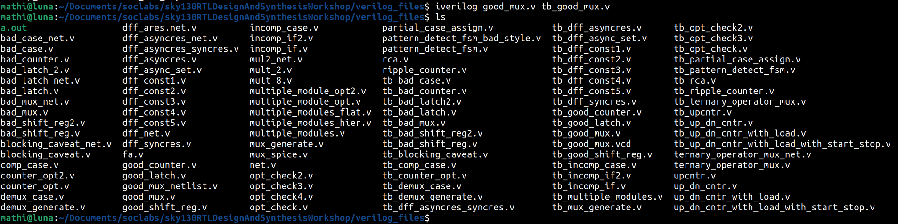
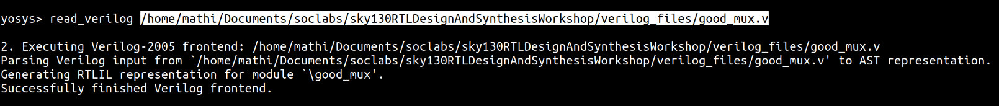

# Day1: Introduction to iverilog, design and testbench

- Simulator: tool used to checking a design (in our case: RTL)

In this program we will be using iverilog to simulate our rtl designs

- Design: verilog codes that have the intended functionalities

- Testbench: setup to apply stimulus(input) to the design to check its functionality

- Synthesizer: tool used for converting the rtl to netlist. We are using Yosys for our program.

- .lib: contains a collection of logical modules and also different flavors of same gate

---


**Block diagram of the Simulating set-up**


**iverilog based Simulation flow**


**Block diagram of the Synthesizer**


1. The design and the testbench is given to the iverilog softaware which gives output as `.vcd` format.
2. This `.vcd` file is simulated using **GTKWave**  
3. The design and the `.lib` is given to the **yosys** synthesizer to generate netlist file.  
4. To verify the netlist, give the netlist and testbench to the iverilog and simulate using GTKWave. 
---

## LABS:  
### Lab1 introduction to lab:

1. Create an directory:
```bash
cd Documents
mkdir soclabs
```
2. Now clone the github repo in the created folder
```bash
git clone https://github.com/kunalg123/sky130RTLDesignAndSynthesisWorkshop.git
```
3. List all the folders/files in the cloned folder;
```bash
cd soclabs/sky130RTLDesignAndSynthesisWorkshop
ls
```


4. The `verilog_files` folder will have all the rtl and testbench codes used in this workshop.


---

### Lab2 Introduction to iverilog and gtkwave
  
`AIM:` To simulate a design using the testbench

1. Open the `verilog_files` folder


2. Use `iverilog` to simulate the design with the testbench 

```bash
cd verilog_files
iverilog good_mux.v tb_good_mux.v
```
- This will create a a.out file.  



3. Run the `a.out` file to generate `.vcd` file.

```bash
./a.out 
```
4. Run the generated `.vcd` file using `GTKWave` 
```bash
gtkwave tb_good_mux.vcd
```


5. Now the GTKWave will be opened. Add the inputs and output signals to the signals column and click `zoom fit` to view the waveform.


6. To view the design and testbench code, use gvim.

If not installed:
```bash 
sudo apt install vim-gtk3
```

```bash 
gvim good_mux.v
gvim tb_good_mux.v
```


---  

### Lab3 Yosys
`AIM:` To synthesize `good_mux.v` using `Yosys`

1. Open the `verilog_files` folder and run yosys
```bash 
yosys
```


2. Now read the library using 
```bash 
read_liberty -lib /home/mathi/Documents/soclabs/sky130RTLDesignAndSynthesisWorkshop/lib/sky130_fd_sc_hd__tt_025C_1v80.lib
```

3. Now read the rtl file that needs to be synthesized
```bash
read_verilog /home/mathi/Documents/soclabs/sky130RTLDesignAndSynthesisWorkshop/verilog_files/good_mux.v  
```

4. Now synthesize the read file 
```bash 
 synth -top good_mux
 ```
 
5. Now use `abc` to synthesize the rtl file using library file 
```bash
 abc -liberty /home/mathi/Documents/soclabs/sky130RTLDesignAndSynthesisWorkshop/lib/sky130_fd_sc_hd__tt_025C_1v80.lib
 ```
 
6. Now to view the generated netlist graphically 
```bash 
show
```

7. Now to see the generated netlist verilog file
```bash
write_verilog -noattr good_mux_netlist.v
```
- The `noattr` command is used to remove unwanted comments in the verilog file.
```bash
!gvim good_mux_netlist.v
```


---


