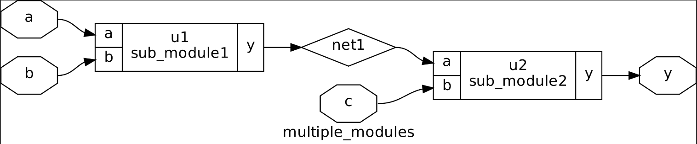

# Introduction to .libs and timings

- **`.lib`** is the library that contains all the characters of a semiconductor device.

    - `.lib` usually have 3 main chatachteristics - **P V T**
        - **P:** Process - Variations due to different fabication machines
        - **V:** Voltage - Variations caused by voltage 
        - **T:** Temperature - Variations due to the temperature.
    - These 3 paramaters determines how any silicon device work.
    - Every libraries should be optimized to make the device work in all range of Voltage and Temperature required.
    - The libraries also includes the units used for time, voltage, resistance, power, etc.
    - The libraries stores the output parameters like **power, area, voltage, capacitance, rise power, fall power, delay, internal power** for all possible inputs.
    - It also consists of different flovours(different area,power) for same device.


## LABS:
### Lab4 Introduction to dot Lib

1. To view the library file and compare the different devices
```bash
cd /home/mathi/Documents/soclabs/sky130RTLDesignAndSynthesisWorkshop/lib
gvim sky130_fd_sc_hd__tt_025C_1v80.lib
```


**Additional tip:** To change the color of your vim editor use
```bash
:colorscheme elflord
```

### Lab5 Hier synthesis Vs flat synthesis
`Aim:` To  synthesize and simulate `multiple_modules.v`  

**FLAT Synthesis**
- Direct, step by step approach
- Used in small design
- When we synthesize the `multiple_modules_flat.v`


**Hierachical Synthesize**
- Structured modelling of model
- Used in large design
- When we synthesize the `multiple_modules.v` file, 2 sub modules will be created.
```bash
cd /home/mathi/Documents/soclabs/sky130RTLDesignAndSynthesisWorkshop/verilog_files
```
```bash
yosys
```
```bash
read_liberty -lib ../lib/sky130_fd_sc_hd__tt_025C_1v80.lib
```
```bash
read_verilog multiple_modules.v
```bash
synth -top multiple_modules
```
```bash
abc -liberty ../lib/sky130_fd_sc_hd__tt_025C_1v80.lib 
```bash
show multiple_modules
```


**Note:** All gates are implemented using universal gates especially NAND GATE to PMOS stacking in NOR GATE. This is due to poor mobility of majority charge carriers(holes) in PMOS.


