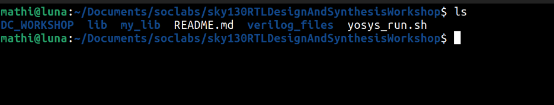
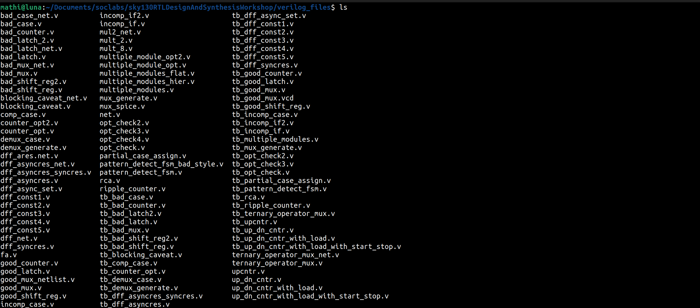
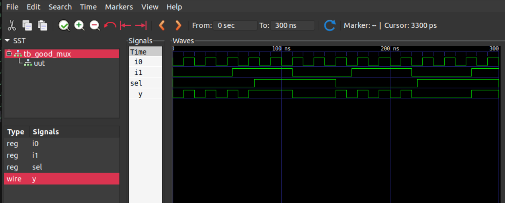
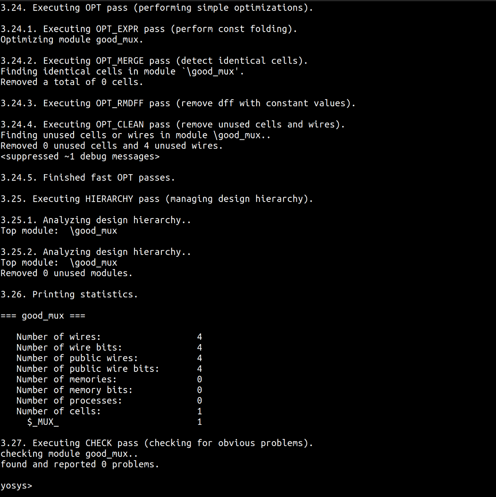
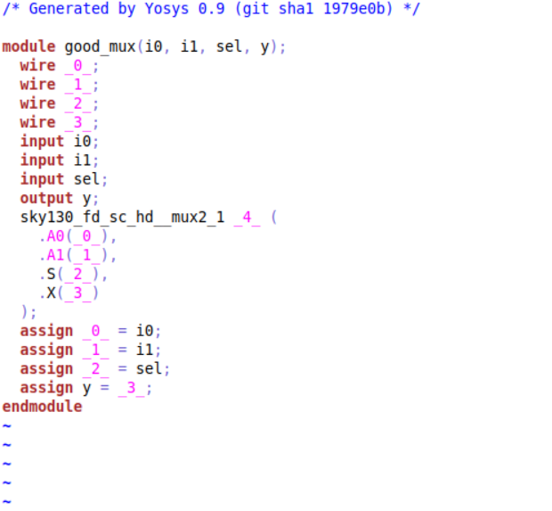

# LABS:
## Lab1 introduction to lab:

1. Create an directory:
```bash
cd Documents
mkdir soclabs
```
2. Now clone the github repo in the created folder
```bash
git clone https://github.com/kunalg123/sky130RTLDesignAndSynthesisWorkshop.git
```
3. List all the folders/files in the cloned folder;
```bash
cd soclabs/sky130RTLDesignAndSynthesisWorkshop
ls
```


4. The `verilog_files` folder will have all the rtl and testbench codes used in this workshop.


---

## Lab2 Introduction to iverilog and gtkwave
  
`AIM:` To simulate a design using the testbench

1. Open the `verilog_files` folder



2. Use `iverilog` to simulate the design with the testbench 

```bash
cd verilog_files
iverilog good_mux.v tb_good_mux.v
```
- This will create a a.out file.  


3. Run the `a.out` file to generate `.vcd` file.

```bash
./a.out 
```
4. Run the generated `.vcd` file using `GTKWave` 
```bash
gtkwave tb_good_mux.vcd
```


5. Now the GTKWave will be opened. Add the inputs and output signals to the signals column and click `zoom fit` to view the waveform.



6. To view the design and testbench code, use gvim.

If not installed:
```bash 
sudo apt install vim-gtk3
```

```bash 
gvim good_mux.v
gvim tb_good_mux.v
```


---  

## Lab3 Yosys
`AIM:` To synthesize `good_mux.v` using `Yosys`

1. Open the `verilog_files` folder and run yosys
```bash 
yosys
```


2. Now read the library using 
```bash 
read_liberty -lib /home/mathi/Documents/soclabs/sky130RTLDesignAndSynthesisWorkshop/lib/sky130_fd_sc_hd__tt_025C_1v80.lib
```

3. Now read the rtl file that needs to be synthesized
```bash
read_verilog /home/mathi/Documents/soclabs/sky130RTLDesignAndSynthesisWorkshop/verilog_files/good_mux.v  
```

4. Now synthesize the read file 
```bash 
 synth -top good_mux
 ```
 
5. Now use `abc` to synthesize the rtl file using library file 
```bash
 abc -liberty /home/mathi/Documents/soclabs/sky130RTLDesignAndSynthesisWorkshop/lib/sky130_fd_sc_hd__tt_025C_1v80.lib
 ```
 
6. Now to view the generated netlist graphically 
```bash 
show
```

7. Now to see the generated netlist verilog file
```bash
write_verilog -noattr good_mux_netlist.v
```
- The `noattr` command is used to remove unwanted comments in the verilog file.
```bash
!gvim good_mux_netlist.v
```


---

## Lab4 Introduction to dot Lib

1. To view the library file and compare the different devices
```bash
cd /home/mathi/Documents/soclabs/sky130RTLDesignAndSynthesisWorkshop/lib
gvim sky130_fd_sc_hd__tt_025C_1v80.lib
```


**Additional tip:** To change the color of your vim editor use
```bash
:colorscheme elflord
```

## Lab5 Hier synthesis Vs flat synthesis
`Aim:` To  synthesize and simulate `multiple_modules.v`  

**FLAT Synthesis**
- Direct, step by step approach
- Used in small design
- When we synthesize the `multiple_modules_flat.v`, no sub modules are created.
```bash
cd /home/mathi/Documents/soclabs/sky130RTLDesignAndSynthesisWorkshop/verilog_files
```
```bash
yosys
```
```bash
read_liberty -lib ../lib/sky130_fd_sc_hd__tt_025C_1v80.lib
```
```bash
read_verilog multiple_modules_flat.v
```bash
synth -top multiple_modules_flat
```
```bash
abc -liberty ../lib/sky130_fd_sc_hd__tt_025C_1v80.lib 
```bash
show multiple_modules_flat
```


**Hierachical Synthesize**
- Structured modelling of model
- Used in large design
- When we synthesize the `multiple_modules.v` file, 2 sub modules will be created.
```bash
cd /home/mathi/Documents/soclabs/sky130RTLDesignAndSynthesisWorkshop/verilog_files
```
```bash
yosys
```
```bash
read_liberty -lib ../lib/sky130_fd_sc_hd__tt_025C_1v80.lib
```
```bash
read_verilog multiple_modules.v
```
```bash
synth -top multiple_modules
```
```bash
abc -liberty ../lib/sky130_fd_sc_hd__tt_025C_1v80.lib 
```
```bash
show multiple_modules
```


```bash
show sub_module1
```


```bash
show sub_module2
```


---

**Note:** All gates are implemented using universal gates especially NAND GATE to PMOS stacking in NOR GATE. This is due to poor mobility of majority charge carriers(holes) in PMOS.
